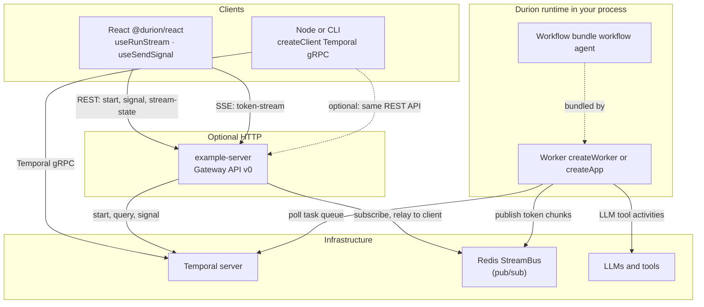

# Durion

Durable workflows, agents, and graphs on Temporal — you define `workflow()`, `agent()`, and `graph()`; you never import Temporal.

## What it is

Durion is an SDK for durable AI execution. You get replay-safe workflows, agents, and state-machine graphs that call LLMs and tools, with cost tracking and optional observability. It is built on [Temporal](https://temporal.io/) and the [Vercel AI SDK](https://ai-sdk.dev/). You write `workflow()`, `agent()`, and `graph()` topologies with `ctx.model()` and `ctx.tool()`; the SDK turns them into Temporal workflows and activities so runs survive restarts and scale.

## Documentation

End-user guides (getting started, concepts, env vars, streaming, troubleshooting) and the **[Gateway API v0](docs/gateway-api-v0.md)** spec are in **[`docs/README.md`](docs/README.md)**.

- **Positioning:** [Why Durion?](docs/why-durion.md) — how this compares to using the Vercel AI SDK alone, rolling your own Temporal + AI SDK, and Temporal’s `@temporalio/ai-sdk` bridge.

## Architecture

Durion splits **authoring** (`workflow` / `agent` / `graph`), **execution** (worker + Temporal), and **optional HTTP + UI** (reference gateway + React). The SDK does not run inside the browser; only **`@durion/react`** does, talking to *your* or the reference gateway.



**`useRunStream`** already opens the token **SSE** and polls **`stream-state`** (same Gateway v0 paths). Use **`useGatewayStreamState`** + **`useGatewayTokenStream`** only when you need separate control; **`useWorkflowStreamState`** / **`useWorkflowTokenStream`** are fully custom URL escape hatches.

- **`@durion/sdk`**: workflow/agent definitions, worker (`createWorker` / `createApp`), `createClient`, streaming helpers (`pipeStreamToResponse`, `RedisStreamBus`). Runs in **Node** next to Temporal workers.
- **`example-server`**: reference **gateway** only — maps HTTP/SSE to Temporal and subscribes to Redis for token relay. Swap or omit it if you expose your own API.
- **`@durion/react`**: **`useRunStream`**, **`useSendSignal`**, Gateway v0 helpers (`useGatewayStreamState`, `useGatewayTokenStream`, URL builders), and low-level hooks above.

## Installation

Install the core SDK in your **worker or server** process:

```bash
npm install @durion/sdk
```

For **React** frontends, also install the React package (requires React 18+ and `@durion/sdk` as peer dependencies):

```bash
npm install @durion/react
```

> **Note**: `@durion/sdk` has a peer dependency on a running [Temporal](https://temporal.io/) server. For local development, use the [Temporal CLI](https://docs.temporal.io/cli): `temporal server start-dev`.

---

## Quick start

**1. Start Temporal**

Use a local Temporal dev server (for example the [Temporal CLI](https://docs.temporal.io/cli): `temporal server start-dev`) or your own deployment. Default address is **`localhost:7233`** — match `TEMPORAL_ADDRESS` in `.env`.

**2. Environment**

```bash
cp .env.example .env
```

Set at least: `TEMPORAL_ADDRESS=localhost:7233`, `TEMPORAL_NAMESPACE=default`, `API_PORT=3000`, and `OPENAI_API_KEY` (or `GEMINI_API_KEY` for Gemini-based examples).

**3. Install and run**

```bash
npm install
cd examples && npm install && cd ..
npm run build
```

**Terminal 1** — run the customer-support example worker (from `examples/`):

```bash
cd examples && npm run worker:customer-support
```

**Terminal 2** — run the in-process client (no HTTP server required):

```bash
cd examples && npm run client:customer-support -- demo customerSupport "I want a refund" ORD-123
```

Other examples use the same pattern: a **`worker`** script plus a **`client:*` / `demo`** script that calls `createClient` and prints the result. See [examples/README.md](examples/README.md). If you prefer an HTTP gateway, you can run `npm run api` from the repo root and build your own routes; `example-server` is optional reference only.

## Usage

Define workflows, agents, and graphs in a file that Temporal will bundle (use the SDK workflow entry point only):

```ts
// workflows.ts
import { z } from 'zod';
import { workflow, agent, graph } from '@durion/sdk/workflow';

export const myWorkflow = workflow('myWorkflow', async (ctx) => {
  const reply = await ctx.model('fast', { prompt: ctx.input.prompt });
  return { reply: reply.result, cost: ctx.metadata.accumulatedCost };
});

export const myAgent = agent('myAgent', {
  model: 'fast',
  instructions: 'You are a helpful assistant.',
  tools: ['my_tool'],
  maxSteps: 8,
});

export const myGraph = graph('myGraph', {
  state: z.object({ topic: z.string(), score: z.number().default(0) }),
  nodes: {
    evaluate: async (ctx) => {
      const response = await ctx.model('fast', { prompt: `Score this: ${ctx.state.topic}` });
      return { score: parseInt(response.result) || 0 };
    },
    approve: async () => ({ topic: 'Approved!' }),
    reject: async () => ({ topic: 'Rejected!' }),
  },
  edges: [
    { from: 'evaluate', to: (state) => state.score > 70 ? 'approve' : 'reject' }
  ],
  entry: 'evaluate'
});
```

In your worker entry, register models and tools with `createRuntime`, then create the worker:

```ts
// run.ts (or worker.ts) — process that calls createWorker and handle.run()
import { z } from 'zod';
import { openai } from '@ai-sdk/openai';
import { createRuntime, createWorker } from '@durion/sdk';

createRuntime({
  models: { fast: openai.chat('gpt-4o-mini') },
  tools: [
    {
      name: 'my_tool',
      description: 'Does something useful',
      input: z.object({ q: z.string() }),
      output: z.object({ answer: z.string() }),
      execute: async ({ q }) => ({ answer: `Result for ${q}` }),
    },
  ],
});

const handle = await createWorker({
  workflowsPath: require.resolve('./workflows'),
  taskQueue: 'my-queue',
});
await handle.run();
```

Workflows, agents, and graphs are Temporal workflows; activities run your model and tool calls. Each `ctx.model()` and `ctx.tool()` is durable — if the worker stops, the run resumes from the last step.

### `createApp()` (one config when worker + starts live together)

`createApp` builds one `RuntimeContext` and wires the same `taskQueue` / Temporal settings to `createWorker()` and a cached `client()`:

```ts
import { createApp } from '@durion/sdk';
import { openai } from '@ai-sdk/openai';

const app = await createApp({
  models: { fast: openai.chat('gpt-4o-mini') },
  tools: [/* ... */],
  workflowsPath: require.resolve('./workflows'),
  taskQueue: 'my-queue',
});

const worker = await app.createWorker();
// Dedicated worker process: await worker.run() (blocks until shutdown).

// Same Node process as an HTTP server: start the server first, then await worker.run()
// at the bottom of main() — see examples/streaming/server.ts.
```

For a **separate API or CLI** that only starts runs, use **`createClient`** below — do **not** call `createApp` again unless you want a second full app instance.

## Starting workflows from code

Use `createClient` and the type-safe `start()` method with a direct function reference:

```ts
// client.ts
import { createClient } from '@durion/sdk';
import { myWorkflow, myAgent } from './workflows';

const client = await createClient({ taskQueue: 'my-queue' });

const handle = await client.start(myWorkflow, { input: { prompt: 'Hello' } });
const result = await handle.result();

const agentHandle = await client.start(myAgent, { input: { message: 'Help me plan a trip' } });
const agentResult = await agentHandle.result();

await client.close();
```

`taskQueue` on `createClient` sets the default for all starts; you can override per call. For REST/HTTP bridges where the workflow type is a string, use `client.startWorkflow('myWorkflow', { input })`.

## React: progressive workflow UI

Spec: **[docs/gateway-api-v0.md](docs/gateway-api-v0.md)** (Gateway API v0 — `/v0/runs/...`, `/v0/workflows/...`). Install **`@durion/react`** and use **`useGatewayStreamState`** + **`useGatewayTokenStream`** with **`baseURL`** and optional **`accessToken`** when your gateway implements v0 (reference: `example-server`). Hook and URL helper names omit “v0”; paths still use `/v0/...`.

```tsx
import { useGatewayStreamState, useGatewayTokenStream } from '@durion/react';

function RunProgress({ workflowId, apiBase }: { workflowId: string; apiBase: string }) {
  const { state, error, loading } = useGatewayStreamState({
    workflowId,
    baseURL: apiBase,
    pollIntervalMs: 1500,
  });
  if (error) return <p>{error.message}</p>;
  if (!state) return <p>{loading ? 'Loading…' : 'No data'}</p>;
  return (
    <pre>
      {state.status} — step {state.currentStep ?? '—'}
      {state.partialReply ? `\n${state.partialReply}` : ''}
    </pre>
  );
}
```

For **custom** HTTP shapes, use low-level **`useWorkflowStreamState`** (`queryFn`) and **`useWorkflowTokenStream`** (`getTokenStreamUrl`). See **`packages/react/README.md`** and **`examples/react-hitl-ui`**.

## Composability

Workflows, agents, and graphs can call each other via `ctx.run()`. It executes a child workflow on the same task queue and returns its result directly.

```ts
// workflows.ts
import { workflow, agent } from '@durion/sdk/workflow';

export const researcher = agent('researcher', {
  model: 'fast',
  instructions: 'You research topics thoroughly.',
  tools: ['web_search'],
});

export const summarizer = workflow('summarizer', async (ctx) => {
  const result = await ctx.model('fast', { prompt: `Summarize: ${ctx.input.text}` });
  return { summary: result.result };
});

// Parent workflow calling both
export const pipeline = workflow('pipeline', async (ctx) => {
  const research = await ctx.run(researcher, { message: ctx.input.topic });
  const summary = await ctx.run(summarizer, { text: research.reply });
  return summary;
});
```

Agents can also delegate to other agents or workflows as tools using `delegates`:

```ts
export const orchestrator = agent('orchestrator', {
  model: 'reasoning',
  instructions: 'You coordinate research and summarization.',
  tools: ['format_output'],
  delegates: [
    { name: 'research', description: 'Deep research on a topic', fn: researcher },
  ],
});
```

When the model calls the `research` tool, the SDK executes `researcher` as a child workflow and returns the result to the model's tool loop.

## What's in the repo

| Path | Description |
|------|-------------|
| `packages/sdk` | Core SDK: `workflow()`, `agent()`, `createRuntime()`, `createWorker()`, `createClient()`, `createApp()` |
| `packages/react` | React hooks: `useWorkflowStreamState` (poll stream state via your API) |
| `packages/eval` | Optional evaluation plugin (capture runs, datasets, metrics) |
| `example-server/` | Reference REST API to start workflows/agents, stream state, token SSE (Redis), and signals |
| `examples/` | Per-example workers and workflows (ReAct, multi-agent, etc.); see [examples/README.md](examples/README.md) |
| `examples/react-hitl-ui/` | Vite + React: HITL + token streaming against `example-server` — [examples/react-hitl-ui/README.md](examples/react-hitl-ui/README.md) |

## Requirements

- **Node.js** 18+
- A **Temporal** server on `TEMPORAL_ADDRESS` (default `localhost:7233`; e.g. [Temporal CLI](https://docs.temporal.io/cli) `temporal server start-dev` or Docker)

## Scripts

| Script | Description |
|--------|-------------|
| `npm run build` | Build all packages |
| `npm run api` | Start the example API server |
| `npm run api:dev` | Start the API with ts-node |
| `npm run ui:hitl` | Vite app for HITL + SSE token streaming ([examples/react-hitl-ui/README.md](examples/react-hitl-ui/README.md)) |
| *(examples)* | Example workers and clients — run from **`examples/`** with `npm run <script>`; see [examples/README.md](examples/README.md) |
| `npm run test` | Run SDK tests |
| `npm run eval:build-dataset` | Build evaluation dataset (optional) |
| `npm run eval:run` | Run evaluation metrics (optional) |

## Observability and evaluation

Enable tracing and metrics by passing `true` or `false` when you call `initObservability()` in your worker or server. The SDK emits `ai.run_model` and `ai.run_tool` spans (OTLP) and metrics such as `ai_model_calls_total`, `ai_model_tokens_total`, and `ai_model_cost_usd_total` (default port 9464). You can send traces to any OTLP-compatible backend (e.g. Jaeger) and scrape metrics with Prometheus and visualize with Grafana if you like; see `docker-compose.metrics.yml` for an optional stack.

```ts
// worker.ts — enable tracing and metrics in code
import { initObservability } from '@durion/sdk';

initObservability({
  tracing: { enabled: true },
  metrics: { enabled: true },
});
// ... then createRuntime, createWorker, etc.
```

For evaluation, call `initEvaluation({ enabled: true, dbUrl: '...' })` when you want to capture runs (and ensure Postgres and the eval schema are in place). Use `enabled: false` or omit the call otherwise. See `scripts/` and `packages/eval` for dataset build and run.

```ts
// worker.ts — optional evaluation (capture runs for datasets and metrics)
import { initEvaluation } from '@durion/eval';

initEvaluation({
  enabled: true,
  dbUrl: process.env.DURION_EVAL_DB_URL,
  defaultVariantName: 'baseline',
});

// ... rest of worker setup
```

## Status

Early-stage. APIs and internals may change. See [CHANGELOG.md](CHANGELOG.md) and [docs/why-durion.md](docs/why-durion.md) for release notes and comparisons to related stacks.

## Contributing

Contributions are welcome. This project is under the [MIT License](LICENSE).
